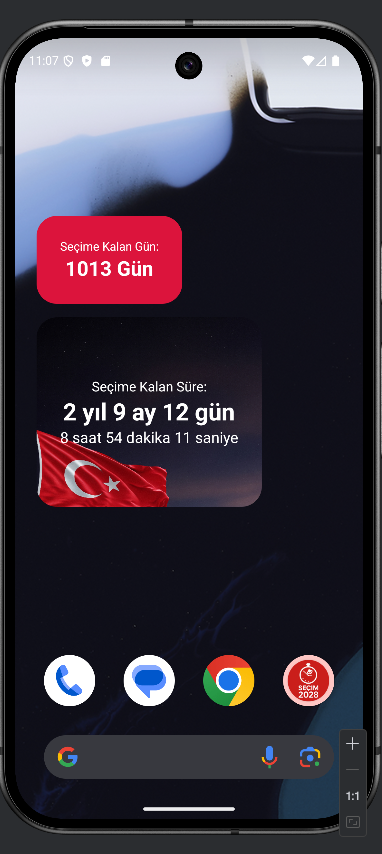
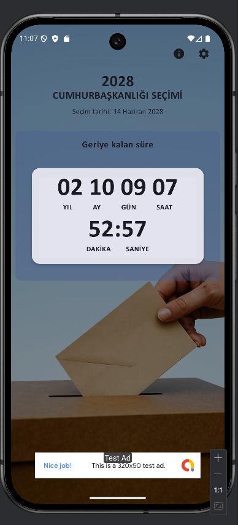
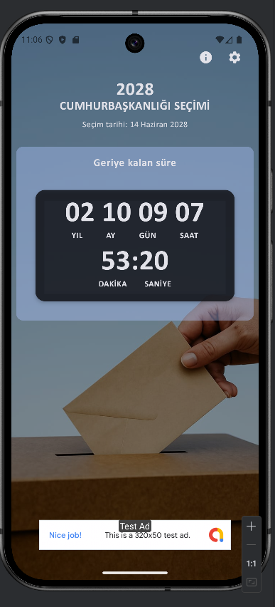

# 🇹🇷 Seçim 2028 Sayaç

Android ana ekranınızda Türkiye'deki **2028 Genel Seçimleri'ne** kalan süreyi gösteren sade, hafif ve reklam destekli bir sayaç uygulaması. Uygulama, farklı boyutlardaki widget seçenekleriyle kullanıcıya özelleştirilebilir ve anlık geri sayım deneyimi sunar.

## 📱 Özellikler

- 🕰️ **Canlı geri sayım** – Gün, saat, dakika ve saniye cinsinden seçim tarihine kalan süre
- 📦 **Ana ekran widget'ları** – 2x1 ve 3x2 boyutlarında widget desteği
- 🎨 **Tema seçimi** – Açık ve koyu tema desteği
- 🇹🇷 **Milli tasarım** – Türk bayrağı ve seçim temalı görseller
- 🔄 **Refresh özelliği** – Widget'ları güncellemek için manuel yenileme düğmesi
- 📡 **Reklam entegrasyonu** – Uygulama içi AdMob banner desteği

---

## 🧩 Widget Bilgileri

Uygulama içerisinde 2 farklı widget yer almaktadır:

| Widget Boyutu | Özellikler |
|---------------|------------|
| 2x1           | Minimal, sade sayaç |
| 3x2           | Genişletilmiş sayaç, bayraklı arka plan, daha fazla bilgi |

Her iki widget da ana ekranınızda **güncel zamanla birlikte otomatik güncellenir**. Ayrıca uzun basarak yeniden boyutlandırılabilir.

> **Not:** Uygulama arka planda çalışmadığı sürece widget'lar periyodik olarak güncellenmez. Ana uygulama açıldığında widget'lar da otomatik güncellenir.

---

## 📦 Kurulum

### Android Studio üzerinden çalıştırmak için:

```bash
git clone https://github.com/Furkanbariss/Secim_2028_Sayac.git
cd Secim_2028_Sayac
```

- `google-services.json` dosyasını `app/` klasörüne eklemeyi unutmayın (Firebase kullanıyorsanız).
- Android Studio ile açın.
- Gradle senkronize edin ve çalıştırın.

---

## 🛠️ Kullanılan Teknolojiler

| Alan | Teknoloji |
|------|-----------|
| Dil | Kotlin |
| UI | Jetpack Compose |
| Widget | Jetpack Glance |
| Reklam | Google AdMob |
| Mimari | MVVM (temel düzeyde) |
| Paketleme | Gradle Kotlin DSL |
| Versiyon kontrolü | Git, GitHub |
| Tema | Dynamic Theming, Material You |

---

## 🔒 İzinler

Uygulama aşağıdaki izinleri kullanabilir:

- **INTERNET** – Reklamlar için
- **ACCESS_NETWORK_STATE** – Bağlantı kontrolü

> Kullanıcıdan herhangi bir hassas izin (konum, kişi, vs.) istenmez.

---

## 📁 Proje Yapısı

```bash
Secim_2028_Sayac/
├── app/
│   ├── src/
│   │   └── main/
│   │       ├── java/com/furkanbarissonmezisik/secim2028sayac/
│   │       │   ├── MainActivity.kt
│   │       │   ├── widget/
│   │       │   │   ├── Secim2028Widget.kt
│   │       │   │   ├── Secim2028ExtendedWidget.kt
│   │       │   │   └── BroadcastReceiver.kt
│   │       └── res/
│   │           ├── layout/
│   │           ├── xml/
│   │           └── drawable/
│   └── build.gradle.kts
├── build.gradle.kts
└── settings.gradle.kts
```

---

## 📸 Ekran Görüntüleri

| Ana Ekran Widget | Tema (Koyu) | Tema (Açık) |
|------------------|-------------|-------------|
|  |  |  |


---

## 🧪 Test & Geri Bildirim

Uygulama aktif olarak geliştirilmekte değildir fakat hatalar raporlanabilir veya pull request gönderilebilir. Her katkı değerlidir.

---

## 🤝 Katkı

Katkı sağlamak için:

1. Fork'la
2. Yeni bir feature branch oluştur
3. Değişikliklerini yap
4. Pull Request gönder

---

## 📅 Hedef Tarih

🇹🇷 Türkiye Genel Seçimleri için hedeflenen tarih:
  
> **Haziran 2028**

Sayaç bu tarihe kadar gün, saat, dakika ve saniye cinsinden geri sayım yapar.

---

## 🧑‍💻 Geliştirici

**Furkan Barış Sönmez Işık**  
GitHub: [@Furkanbariss](https://github.com/Furkanbariss)  
E-posta: `sonmezisikfurkanbaris@gmail.com`

---

## 📄 Lisans

```
MIT License

Bu proje açık kaynaklıdır. Dilediğiniz gibi kullanabilir, dağıtabilir ve değiştirebilirsiniz.
```

---

## 💬 Ek Notlar

- Uygulama herhangi bir siyasi oluşumla bağlantılı değildir.
- Tamamen kişisel bir geri sayım ihtiyacını karşılamak amacıyla yapılmıştır.
- Uygulama içinde reklamlar bulunur fakat kullanıcı verisi toplanmaz.
